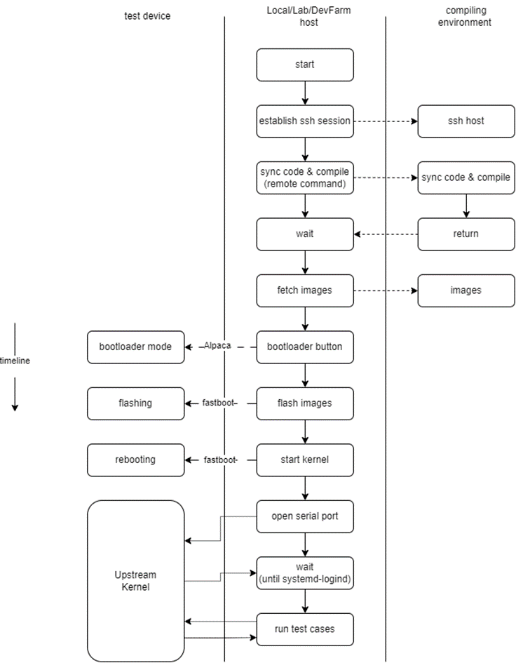
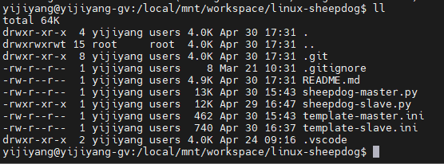
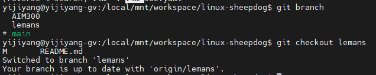
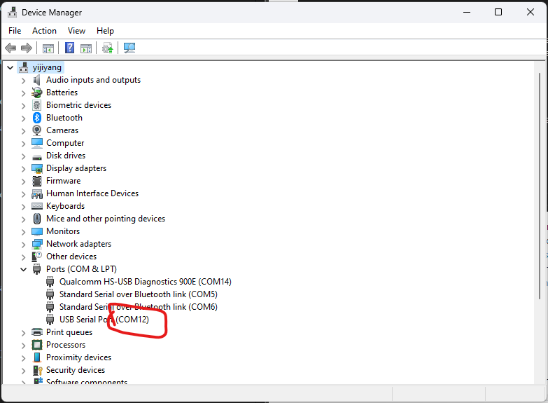
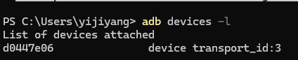
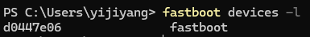
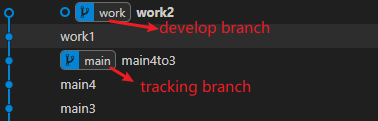
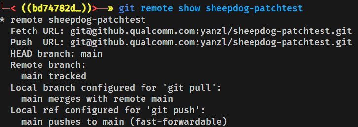
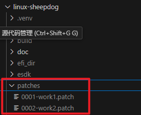

# linux-sheepdog
* The principle and how-to can be found on [this](https://confluence.qualcomm.com/confluence/display/LK/Linux+Kernel+Test+Tool) confluence page.
* This tool was designed to verify upstream kernels on different physical platforms.
* It can implement syncing, making patches, compiling, flashing and verification automatically.
* Two parts of this tool can be used either unified or seperately.


# Terms
* slave: refer to the environment where code can be synced and compiled. Usually a server or a gv. It also referred to as 'compilation environment'.
* master/host: refer to the environment where the target test device connected to. 


# Preparation
## Environment
* A slave with enough disk space.
* Ensure **network connectivity** between master and slave.

## Install Python modules
  ```bash
    python -m pip install <module name>
  ```
  Modules for compilation environment:
  ```bash
    GitPython
  ``` 
  Modules for the host:
  ```bash
    pyserial, paramiko, pydevicetree, python-magic-win64, pyfatfs, extract-dtb, fs, pydtc
  ``` 
* You may get error messages when installing pydtc:
'error: Microsoft Visual C++ 14.0 or greater is required. Get it with "Microsoft C++ Build Tools": https://visualstudio.microsoft.com/visual-cpp-build-tools/ '
* Follow the instructions to install necessary development components on your host


## Install TACDev
* TACDev is a Python module provided by **alpaca** and it should be installed manually on master side.
* Python greater than 3.8 should be installed on both sides.
* Install the Alpaca software suite from the QPM.
* Navigate to the path 'C:\ProgramData\Qualcomm\Alpaca\Python\XPlatform'(should have the `setup.py` to install TACDev) and execute the setup.bat(need to be configured according to your own work environment)

example setup.bat
```bat
DEL /F /Q /S TACDev.egg-info > NUL
RMDIR /Q /S TACDev.egg-info

DEL /F /Q /S build > NUL
RMDIR /Q /S build

DEL /F /Q /S dist > NUL
RMDIR /Q /S dist

; need to change to your python.exe path
C:\Users\yanzl\AppData\Local\Microsoft\WindowsApps\python3.9.exe -m pip uninstall -y tacdev
 
DEL /F /Q /S EPMDev.egg-info > NUL
RMDIR /Q /S EPMDev.egg-info

DEL /F /Q /S build > NUL
RMDIR /Q /S build

DEL /F /Q /S dist > NUL
RMDIR /Q /S dist

; need to change to your python.exe path
C:\Users\yanzl\AppData\Local\Microsoft\WindowsApps\python3.9.exe -m pip uninstall -y epmdev

; need to change to your python.exe path
C:\Users\yanzl\AppData\Local\Microsoft\WindowsApps\python3.9.exe setup.py install

```

* Ensure join 'oe.filer.ro' group to ensure your access to esdk.

## Install apt applications

* diffstat

```bash
sudo apt install diffstat
```

# Download
* Clone this tool from GitHub to you compiling environment.
```bash
git clone https://github.qualcomm.com/yijiyang/linux-sheepdog
```
* This tool consists of two parts. Files for master side including sheepdog-master.py and template-master.ini. While files for the slave side including sheepdog-slave.py and template-slave.ini.

* Tracking origin/main is recommended.


# Deployment
* Files of two parts should be deployed manually. Both copying files or sharing directories is okay. There's no restrictions on where files should be placed.
* Ensure files for master side can be accessed from master. The same goes for slave.
* It is recommended to place files to local path for faster execution.

# Configuration
* Revise config files according to requirements.
* Relative paths are based on user's working directory.
* Be aware of the **different path formats** in Windows and Linux.


## The master side
For example, in the `template-master.ini`:
### REMOTE
* **addr**: the IP address or  hostname of your compilation environment.
* **username**: the username for login into the compilation environment.
* **slave_script** & slave_config: the name of sheepdog-slave.py and template-slave.ini in your compilation environment.
* **local_repo**: the path of an existing local repo (usually upstream kernel) in compilation environment if it has been downloaded before. Using this option would save much time on syncing code. **But unstaged changes in that repo will be discarded!**
* **remote_path**: a path of the slave side where artifacts (the images) of sheepdog-slave stored.
### IMAGE


* **local_path**: the path of the host to which these artifacts (the images) are going to be copied.
* **workspace**: the path where you want the remote command to be executed in compilation environment.
* **names**: images' names. If there're more than one image, each name can be separated with space.
### DEVICE
* **com_port**: get it from device manager.

* **serial_num**: get it from either adb or fastboot
  ```bash
    adb devices -l
    fastboot devices -l
  ```



## The slave side
### REPO
* **url**: the URL of the target repository going to be test
* **cmdline**: the kernel command line for this test
### TOOLS
* **toolchain_prefix**: the prefix of cross compiling tools. It's same with CROSS_COMPILE option * when compiling kernel using 'make'.
* **mkbootimg**: the path of tool 'mkbootimg'.
### KERNEL_OPTION
* **kernel**: Kconfig options that should be compiled into kernel during this test.
* **module**: Kconfig options that should be compiled as module during this test.
* **close**: Kconfig options that shouldn't be compiled during this test.
### PATCH
now, we just execute below commands to generate  and test patches. So user can control the `start_commit` and `end_commit` of patches. But the commit to be applied and tested is just the tracking branch.(Checkout to tracking branch hard before). 
More information and example is [here](#make-and-test-patch).
```bash
 git forward-patch {patch_branch} -o {patch_build_dir}
 git apply --check  {patch_build_dir}/*.patch 
```
* **patch**: control generate patch or not. `True` open, other close.
> patch = True

* **patch_branch**: used like commands abrove

* **patch_build_dir**: patches will be generated in

  ⚠️ patch_build_dir will be generated **under thesheepdog directory**, and "./" will be reset to "./patches/"
* **checkwithreset**: control if or not reset to clean work tree after apply patches. `True` open, other close.
 
# Integrated Execution
* It would trigger sheepdog-slave.py to sync and compile.
* Syncing code usually time consuming. If there's an existing repo in compilation environment * cloned before, just filled out 'local_repo' in REMOTE section of the config file.
* The process starts at the host with the following command:
  ```bash
    <path>\sheepdog-master.py [--config <config file>]
  ```
* --config: specify config file's path of the master side. If this option not provided, it would search under the same path of the script.
* --local-images: skip syncing and compilation of slave side. Verify existing images in 'local_path' of 'IMAGE' section directly.
* username and password are required after execution if no-password of ssh hasn't been configured.


# Split Execution
* The two parts can be executed separately if you only want to sync & compile upstream or you want to verify existing meta.
* The script of the host part can be used alone by adding an '--local-images' option.
  ```bash
    <path>\sheepdog-master.py [--config <config file>] [--local-images]
  ```
* It will find images from 'local_path' in 'IMAGE' section of the config file.
* The slave script can be used separately as follows:
  ```bash
    <path>/sheepdog-slave.py [--config <config file>] [--local <local repo path>]
  ```
* --config: specify config file's path of the master side. If this option not provided, it would search under the same path of the script.

* --local: same meaning as 'local_repo' in 'REMOTE' section of template-master.ini which represents the path of an existing local repo (usually upstream kernel) in compilation environment if it has been downloaded before


# Example

## make and test patch

1. example git work tree:



* main is tracking remote `linux-sheepdogtest`
* work is developers develop branch

⚠️ **sheepdog firstly find the tracking branch `main` and then checkout to it. After that all commands will execute with the `HEAD` in this `main` commit. Expecially will apply patches to `main` one by one to test patches correction.**

2. example slaver.ini
```
[REPO]
url = git@github.qualcomm.com:yanzl/sheepdog-patchtest.git
# tracking branch
branch = main
# tracking remote
name = sheepdog-patchtest
tag =

...

[PATCH]
# open patch function
patch = True
# will generate patches from main to work
patch_branch = main..work
# will generat in sheepdog_directory/patches/
patch_build_dir = ./patches/
# after test patches, will delete the changes, made by patch apply
checkwithreset = True
```
After run sheepdog, will get patches

